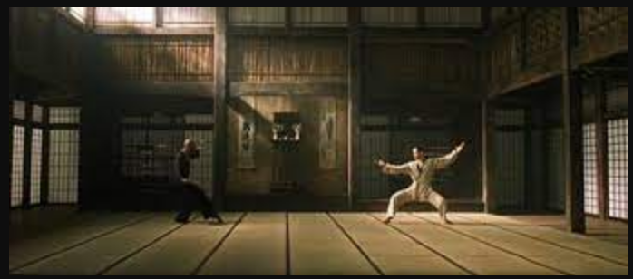
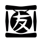
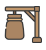
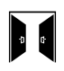

<!-- PROJECT SHIELDS -->

[![Contributors][contributors-shield]][contributors-url]
[![Forks][forks-shield]][forks-url]
[![Stargazers][stars-shield]][stars-url]
[![Issues][issues-shield]][issues-url]
[![MIT License][license-shield]][license-url]
[![LinkedIn][linkedin-shield]][linkedin-url]

<!-- PROJECT LOGO -->

#  Projeto Coding Dojo

Projeto de um coding Dojo multiplataforma e multi linguagens

#   Bem vindos

Estou planejando em criar neste repositorio um coding dojo com proposta de exercicios de programaçao em diversas linguagens. Visando compartilhar o conhecimento e possibilitando aprender mais sobre programaçao, trocando dicas e truques com os amigos.

##   Objetivo

Aprender a programar melhor

- O que aprendemos com o Coding Dojo de hoje;
- O que podemos melhorar para a realização dos próximos Coding Dojos;
- O que devemos continuar fazendo nos próximos Coding Dojos.

###   1.000 horas para torna-se um mestre

Seja bem vindo, copie a vontade.

   [Workspace](Workspace) - Explore e descubra

---

#### * DIO - Digital Inovation One *
######  [Inscreva-se na Dio](https://digitalinnovation.one/sign-up?ref=R5J3ZLTIFS)  

######  [Vagner Bellacosa perfil na Dio](https://web.digitalinnovation.one/users/vagnerbellacosa?tab=achievements)  

<!-- MARKDOWN LINKS & IMAGES -->
<!-- https://www.markdownguide.org/basic-syntax/#reference-style-links -->
[contributors-shield]: https://img.shields.io/github/contributors/VagnerBellacosa/Projeto_CodingDojo.svg?style=for-the-badge
[contributors-url]: https://github.com/VagnerBellacosa/Projeto_CodingDojo/graphs/contributors
[forks-shield]: https://img.shields.io/github/forks/VagnerBellacosa/Projeto_CodingDojo.svg?style=for-the-badge
[forks-url]: https://github.com/VagnerBellacosa/Projeto_CodingDojo/network/members
[stars-shield]: https://img.shields.io/github/stars/VagnerBellacosa/Projeto_CodingDojo.svg?style=for-the-badge
[stars-url]: https://github.com/VagnerBellacosa/Projeto_CodingDojo/stargazers
[issues-shield]: https://img.shields.io/github/issues/VagnerBellacosa/Projeto_CodingDojo.svg?style=for-the-badge
[issues-url]: https://github.com/VagnerBellacosa/Projeto_CodingDojo/issues
[license-shield]: https://img.shields.io/github/license/VagnerBellacosa/Projeto_CodingDojo.svg?style=for-the-badge
[license-url]: https://github.com/VagnerBellacosa/Projeto_CodingDojo/blob/master/LICENSE.txt
[linkedin-shield]: https://img.shields.io/badge/-LinkedIn-black.svg?style=for-the-badge&logo=linkedin&colorB=555
[linkedin-url]: https://www.linkedin.com/in/VagnerBellacosa/
[product-screenshot]: Image/capa.png

